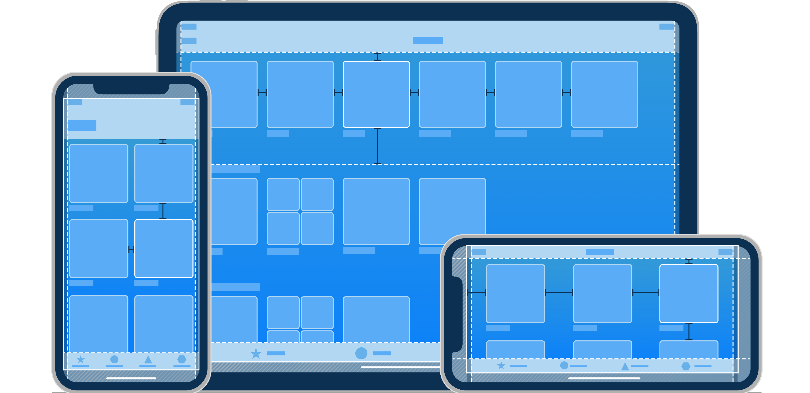

# ios-shoppe-demo
iOS Client for the example "Shoppe" app

The iOS Shoppe Demo is a reference application that provides tips and tricks to using [FullStory](https://www.fullstory.com/) on [Native Mobile](https://www.fullstory.com/mobile-apps/) iOS.

## Getting started

To apply the FullStory iOS Plugin, you'll need [Xcode](https://developer.apple.com/xcode). You'll then download or clone this repo to your desired directory.

To open the project, use "File > Open" in Xcode and select either "swift" or "Objective-C"(coming soon) folder.

## Adding FullStory to the app

If you have [signed up](https://www.fullstory.com/plans/) for FullStory, add the following to your `Info.plist`:
```
<key>FSOrgId</key>
  <string>YOUR_ORG_HERE</string>
```

Your orgId can be found on the _Settings_ page once you are logged in to FullStory.  It'll be next to the `window['_fs_org']` variable in the snippet.  For more information, see [Install your recording snippet](https://help.fullstory.com/hc/en-us/articles/360047075853).

For successful recording, please do not change the `server` value. It should always be `https://fullstory.com`.

Sync gradle after the changes and your app should be fully instrumented with your org information.

## Using the app

The Shoppe is a super simple e-commerce application. Build and run the app on your emulator, you can:

- Browse a list of products int the _Market_.
- Use the **Add to Cart** button to add products to your shopping cart.
- Go to your _Shopping Cart_ by clicking on the cart icon on the top right corner.
- Review your cart and then click the **Checkout** button.
- Fill out the form on the _Checkout_ view and click **Purchase**. The app persists locally all the information from this view. Please do **not** use your real information.
- When clicking **Purchase** your information is validated and a Toast message will be shown. The purchase is successful if all fields passed the validate and your subtotal is greater than 0.

## Using FullStory with the app

Now that you've used the app, you have a session in FullStory. Head on over to FullStory [https://app.fullstory.com/login](https://app.fullstory.com/login).

Make sure you background or kill your app. This ensures that FullStory receives a signal in order to start processing your session. This may take few minutes.

Then you can find your session by going to the mobile segment in FullStory, or build your own segment/search.

Check out a few sessions and explore the data to get a feel for how you'd use FullStory on your own app.

## App Architecture

This app was developed based on [Apple's Human Interface Guidlines](https://developer.apple.com/design/human-interface-guidelines/ios/overview/themes/)



## Tips and tricks

- Checkout our [Native Mobile Privacy Rules](https://help.fullstory.com/hc/en-us/articles/360043356573-Native-Mobile-Privacy-Rules).
- For step by step guide checkout: [Getting Started Guide](https://help.fullstory.com/hc/en-us/articles/360042772333-Getting-Started-with-iOS-Recording).
